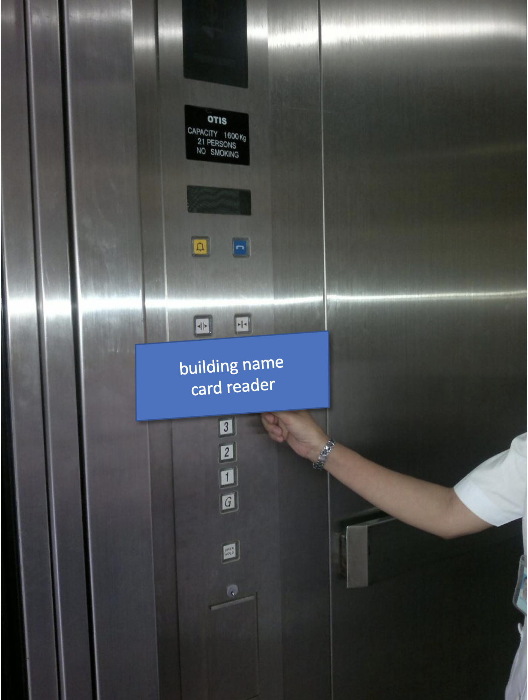
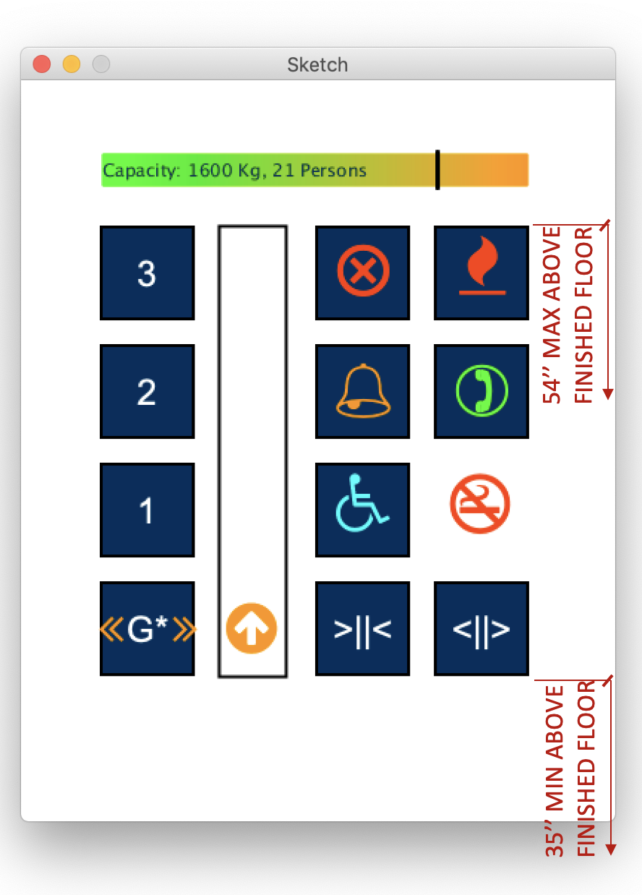

# Report 
**Important Note:**

### Links
[Presentation page](https://phamvanvung.github.io/hcihw1vung) (https://phamvanvung.github.io/hcihw1vung)

[GitHub repository](https://github.com/phamvanvung/hcihw1vung) (https://github.com/phamvanvung/hcihw1vung)

[Gif](report/images/hw1.pham.gif) (https://phamvanvung.github.io/hcihw1vung/report/images/hw1.pham.gif)

[Demo](https://phamvanvung.github.io/hcihw1vung/dist.zip)

### C criteria

- Take photos of the control interface

- Find the issues with the current design/Explain why it is bad.
1. Missing support for disability (e.g., it is too high for wheel chair people, missing support for blind people).
2. Missing several user feedback (current position, door opening, door closing, door opened, door closed, capacity and current weight).
3. Buttons are scattered in a large space (lost focus).
5. Missing emergency stop button (to stop in case needed)

### Getting B:
- Functionalities are listed from more to less common
0. Accessibility (support for disabled people) 
1. Knowing what direction the elevator is moving to
2. Select floor
3. Closing door button
4. Holding door button
5. Knowing current position
6. Knowing current capacity
7. Emergency stop
8. Emergency elevator operator call
9. Emergency alarm
10. Fire operator support

- What is the common sequence of actions?
1. Checking the direction
2. Checking the capacity
3. Selecting the floor
4. Knowing the current floor (or current position if details could be provided)
5. Knowing that the door is opened
6. Exit the elevator.

- How does the elevator support the user figure out how to make it work?
In general we nee to be consistent (so user can use their existing knowledge to know what's going on).
Then we should give feedback/indicators to users. E.g.,
1. Images, color, text, animation.
2. Sound (for blind people, touch and drag for screen reader)
  
- How does the elevator provide feedback to the user?
Knowing human cognitive ability, images, color, text, voice, animation.
1. Knowing the need (Dragging on the screen will enable screen reader/Dragging over a button will read the button out loud)
2. Using icons, images appropriately (e.g., fire, call, etc) 
3. Give indicator for selected button (e.g., color change or voice)
4. Animation for moving things (arrow to show the moving direction and current position, or blinking arrow showing that the door is opening or closing)
5. Colors (normally green for safe and red for danger)
6. Give text description (if needed)

- What are some common mistakes you can make with this current design?
1. Get out to a wrong floor
2. Not knowing whether we are close to the elevator capacity
3. Not being able to select or select a wrong button (for disabled people) 
4. Informing a wrong location in case of emergency (e.g., to the elevator operator) 

- Suggest the improvements to make on the control interface. Sketch your solution. And justify your design decisions.
1. Support for disable people (knowing human cognitive ability)
2. Be consistent (so people can use their existing knowledge)
3. Visibility/feedback (letting users know what's going on)
4. Confirmation/reversible (users may make mistake)

### Getting A
- Come with your design for the touch screen? What is the screen size that you want?
Display: 27'', Width: 20.3'' | 51.6 cm, Height: 25.6'' | 65 cm (for this specific case)
- Design and implement interactive features/user feedback
1. Normal functionalities (select floor, close door, open door)
2. Current position and direction
3. Indicating door opening/closing/opened/closed events
4. Drag the screen to enable screen reader
5. Drag over a button, its functionality will be read out loud
6. Current capacity indicator

### Extra credits:
- Your design supports people with disabilities
1. Wheel chair people, the position should follow standard position to support accessibility.

2. For blind people
Screen reader will be enabled automartically when user dragging on the screen.
Button will be read out loud if the user is dragging over a button.
Read the events (door closing, door opening, door opened, door closed, current floor, etc) to the user.

- You provide extra useful information on the display interface.
1. Capacity and current weight
2. Current position and moving direction
3. Current floor and door is opening, closing, opened or closed
